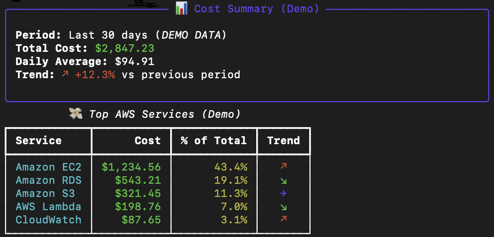
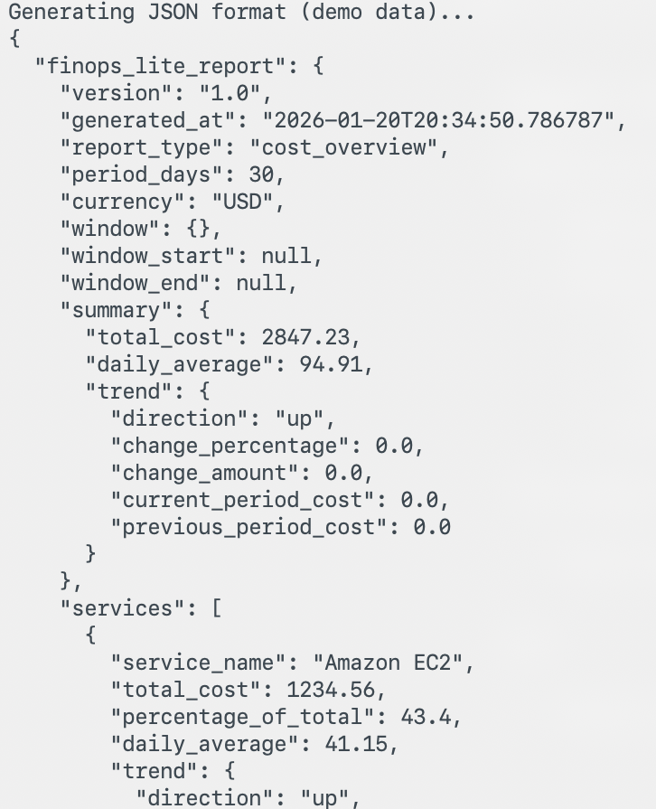
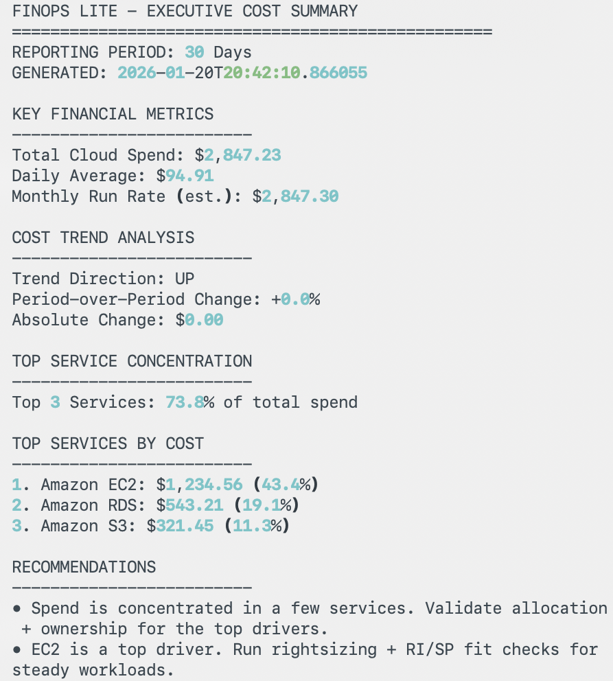

# FinOps Lite

[](https://github.com/dianuhs/finops-lite/actions/workflows/ci.yml)
[](https://www.python.org/downloads/)
[](https://opensource.org/licenses/MIT)
[](https://github.com/psf/black)
[](https://codecov.io/gh/dianuhs/finops-lite)

A CLI-first cloud cost analysis engine built on AWS Cost Explorer, designed to turn raw spend data into clear, decision ready signals.

---

## Why FinOps Lite Exists

Most cloud cost tooling optimizes for visualization. FinOps Lite optimizes for reasoning.

Instead of dashboards that passively refresh, FinOps Lite produces deterministic cost reports that can be inspected, exported, diffed across time, and embedded directly into workflows. It is designed for practitioners who want to understand why spend changes, not just that it did.

FinOps Lite intentionally focuses on correctness, portability, and signal quality. It is a foundation layer for higher-order FinOps automation rather than an all-in-one platform.

---

## What’s New in FinOps Lite v1

This release focuses on making FinOps Lite a stronger foundation layer rather than adding surface level features.

Key upgrades include:

- A FOCUS-aligned export that produces line item cost records with explicit time windows and allocation metadata
- Schema-stable CSV output designed for automation, diffing, and downstream systems
- Clear separation between analysis (cost reasoning) and enforcement (future Guard Dog layer)
- Deterministic outputs suitable for CI, audits, and reproducible decision making

These changes position FinOps Lite as an engine for FinOps systems, not a dashboard replacement.

---

## Core Capability: Rolling Cost Overview

Analyze the last N days of cloud spend and compare it to the previous period.

Includes:
- total spend
- daily average
- period-over-period trend
- top services by cost and concentration

```bash
finops cost overview --days 7
```



---

## Automation-Ready Output Formats

All reports can be rendered in multiple formats depending on the audience or downstream use case:

- table – rich CLI output for operators
- json – stable, machine-readable schema for pipelines
- csv – spreadsheet-friendly
- yaml – configuration and pipeline friendly
- executive – narrative summary with recommendations

### JSON Output (Schema-Stable)

```bash
finops cost overview --days 30 --format json
```



---

## Executive Summary Mode

Executive output translates raw cost data into decision-oriented language.

```bash
finops cost overview --days 30 --format executive
```



---

## FOCUS-Aligned Cost Export

FinOps Lite can export cost data in a FOCUS-aligned, line-item format suitable for downstream FinOps tooling.

```bash
finops export focus --days 7
```

The export produces one row per provider, service, and day, with explicit time windows and allocation metadata. The result is a clean, trustworthy cost dataset that can be extended as tagging, account structure, or multi-cloud support is added.

---

## Demo & Fixture Mode

FinOps Lite can operate without live AWS spend.

If a Cost Explorer fixture exists in:

```
finops_lite/fixtures/
```

the CLI will automatically use it instead of calling AWS.

All screenshots in this README were generated using fixture-based demo data.

---

## Installation

```bash
pip install -e .
```

---

## AWS Configuration

FinOps Lite uses standard AWS authentication methods:
- aws configure
- named profiles
- environment variables
- STS-based credentials

---

## Design Principles

FinOps Lite is intentionally narrow and composable.

It emphasizes:
- correct cost windows
- transparent aggregation logic
- repeatable outputs
- portability across teams and environments

---

## Roadmap

- Guard Dog – automated cost hygiene and anomaly detection
- Recovery Economics – cost-to-value analysis and optimization modeling

---

## License

MIT


