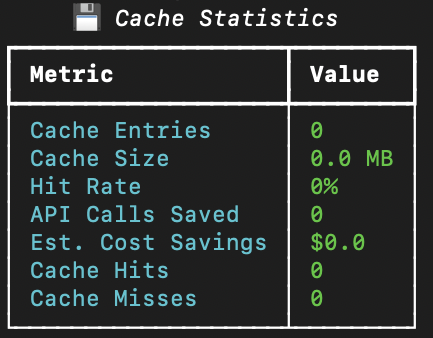
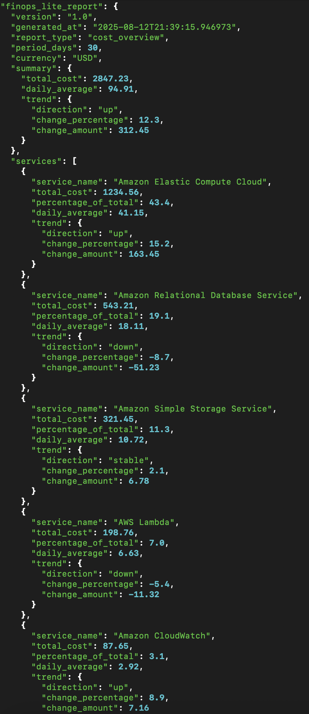

# FinOps Lite

**Professional AWS cost management in your terminal** — Lightning-fast cost visibility, optimization, and governance.

[](https://github.com/dianuhs/finops-lite/actions/workflows/ci.yml)
[](https://www.python.org/downloads/)
[](https://opensource.org/licenses/MIT)
[](https://github.com/psf/black)
[](https://codecov.io/gh/dianuhs/finops-lite)

> Transform complex AWS billing into clear, actionable insights — all from your command line.

## Overview

FinOps Lite is a Python-based CLI tool designed to simplify AWS cost management for small teams and enterprises. By providing clear cost insights, tag governance, and optimization recommendations, it empowers FinOps practitioners to reduce cloud waste and improve financial accountability. Built with performance and user experience in mind, it's a practical solution for modern cloud cost challenges.

## Why FinOps Lite?

Cloud cost management is often complex and overwhelming, especially for small teams or organizations new to FinOps. FinOps Lite was born out of a desire to simplify AWS cost visibility and optimization, empowering teams to make data-driven decisions without enterprise-grade complexity. This project reflects my passion for bridging technical and financial domains to drive cloud efficiency.

## What It Looks Like

Monthly cost totals with automatic fallback <br>

&nbsp;


Performance metrics and caching details <br>

&nbsp;


Structured output for automation and reporting <br>

&nbsp;


## Sample Output

```bash
$ AWS_PROFILE=finops-lite finops
💰 AWS Cost Summary
Month-to-Date Total: $1,247.83
(Data from Dec 1-15, 2024)

$ AWS_PROFILE=finops-lite finops --last-month
💰 AWS Cost Summary  
Last Month Total: $2,156.92
(Data from Nov 1-30, 2024)

$ AWS_PROFILE=finops-lite finops services --days 30 --top 5
🔍 Top Services (Last 30 Days)
1. EC2-Instance: $892.45
2. Amazon RDS Service: $234.12  
3. Amazon Simple Storage Service: $89.23
4. CloudWatch: $31.04
5. NatGateway: $28.67
```

## Try It in 30 Seconds

```bash
# Install and run
git clone https://github.com/dianuhs/finops-lite.git
cd finops-lite
pip install -e .
finops --dry-run cost overview
```

## Demo

```bash
$ finops cost overview
```

```
╭────────────────────── Cost Summary ──────────────────────╮
│                                                          │
│ Period: Last 30 days                                     │
│ Total Cost: $2,847.23                                    │
│ Daily Average: $94.91                                    │
│ Trend: ↗ +12.3% vs previous period                       │
│ Currency: USD                                            │
│                                                          │
╰──────────────────────────────────────────────────────────╯

          Top AWS Services           
┏━━━━━━━━━━━━┳━━━━━━━━━━━┳━━━━━━━━━━━━┳━━━━━━━┓
┃ Service    ┃      Cost ┃ % of Total ┃ Trend ┃
┡━━━━━━━━━━━━╇━━━━━━━━━━━╇━━━━━━━━━━━━╇━━━━━━━┩
│ Amazon EC2 │ $1,234.56 │      43.4% │   ↗   │
│ Amazon RDS │   $543.21 │      19.1% │   ↘   │
│ Amazon S3  │   $321.45 │      11.3% │   →   │
│ AWS Lambda │   $198.76 │       7.0% │   ↘   │
│ CloudWatch │    $87.65 │       3.1% │   ↗   │
└────────────┴───────────┴────────────┴───────┘
```

```bash
$ finops cache stats
```

```
     Cache Statistics     
┏━━━━━━━━━━━━━━━━━━━┳━━━━━━━┓
┃ Metric            ┃ Value ┃
┡━━━━━━━━━━━━━━━━━━━╇━━━━━━━┩
│ Cache Entries     │ 12    │
│ Cache Size        │ 0.3MB │
│ Hit Rate          │ 67%   │
│ API Calls Saved   │ 23    │
│ Est. Cost Savings │ $0.23 │
│ Cache Hits        │ 23    │
│ Cache Misses      │ 11    │
└───────────────────┴───────┘
Good cache performance! Your repeated queries are much faster.
```

## What Makes FinOps Lite Special

- **Lightning Fast** — Intelligent caching saves time and money on repeated queries
- **Beautiful Output** — Rich tables, charts, and progress bars that actually look good
- **Bulletproof Errors** — Helpful guidance when things go wrong (not cryptic AWS errors)
- **Cost Aware** — Tracks and minimizes your API costs while maximizing insights
- **Professional Grade** — Enterprise-ready reliability with comprehensive testing

## Cost & Permissions

> **AWS Cost Explorer API**: ~$0.01 per call. FinOps Lite includes intelligent caching to minimize costs.
> 
> **Required IAM Permissions**: Read-only access with `ce:GetCostAndUsage`, `ce:GetRightsizingRecommendation`. See [detailed permissions](#recommended-iam-permissions) below.

## Real-World Use Cases

**Startup Cost Control**
A small team uses `finops cost overview --days 7` to monitor weekly AWS spending and identifies a 25% cost spike due to untagged EC2 instances running in non-production environments.

**Enterprise Tag Governance** 
A FinOps analyst runs `finops tags compliance --export compliance-report.csv` to generate executive reports, ensuring 95% tag coverage across resources for accurate cost allocation.

**Developer Cost Awareness**
A DevOps engineer uses `finops optimize rightsizing --savings-threshold 50` to find underutilized EC2 instances, identifying $800/month in potential savings through rightsizing recommendations.

**Monthly Executive Reporting**
A cloud architect exports `finops cost overview --format executive --export monthly-summary.json` to create stakeholder-friendly cost summaries with trend analysis and optimization opportunities.

## Key Features

### Cost Analysis
- **Month-to-date totals** with intelligent fallback to last month
- **Cost by service** breakdown with trend analysis
- **Multiple output formats** (table, JSON, CSV, YAML, executive summary)
- **Smart caching** to avoid duplicate API calls

### Tag Governance
- **Tag compliance** reporting across all resources
- **Cost impact** analysis for untagged resources
- **Bulk tagging** recommendations (coming soon)

### Cost Optimization
- **EC2 rightsizing** recommendations with confidence scores
- **Reserved Instance** opportunity analysis
- **Unused resource** detection (coming soon)
- **Trend alerts** for cost spikes

### Performance & Caching
- **Intelligent caching** saves money on API calls
- **Performance tracking** with detailed metrics
- **Cache management** commands for full control
- **Cost savings** reporting (tracks money saved from caching)

## Installation & Setup

### Install from Source
```bash
git clone https://github.com/dianuhs/finops-lite.git
cd finops-lite
pip install -e .
```

### AWS Setup
```bash
# Create AWS profile (recommended)
aws configure --profile finops-lite

# Enable Cost Explorer in AWS Console
# Go to: AWS Cost Management → Cost Explorer → Enable

# Test installation
finops --help
```

## Quick Start

```bash
# Basic cost overview
finops cost overview

# Check cache performance
finops cache stats

# Export to JSON
finops cost overview --format json --export report.json

# Performance tracking
finops --performance cost overview
```

## Advanced Usage

### Cost Analysis
```bash
# Different time periods
finops cost overview --days 7
finops cost overview --days 90

# Force refresh (bypass cache)
finops cost overview --force-refresh

# Executive summary format
finops cost overview --format executive
```

### Cache Management
```bash
# Check cache performance
finops cache stats

# Clear cache
finops cache clear

# Disable cache for one command
finops --no-cache cost overview
```

### Output Formats
```bash
# Beautiful terminal tables (default)
finops cost overview

# Machine-readable formats
finops cost overview --format json
finops cost overview --format csv
finops cost overview --format yaml
```

## Prerequisites

- **Python 3.9+**
- **AWS CLI configured** with appropriate credentials
- **AWS Cost Explorer enabled** (may take 24-48 hours for first-time setup)

### Recommended IAM Permissions

Create a read-only IAM user with these policies:
- `ReadOnlyAccess` (AWS managed policy)
- Custom policy for Cost Explorer:

```json
{
    "Version": "2012-10-17",
    "Statement": [
        {
            "Effect": "Allow",
            "Action": [
                "ce:GetCostAndUsage",
                "ce:GetRightsizingRecommendation",
                "ce:GetReservationCoverage",
                "ce:GetUsageReport"
            ],
            "Resource": "*"
        }
    ]
}
```

## Error Handling

FinOps Lite provides helpful guidance when things go wrong:

```bash
$ finops cost overview
╭──────────────────────── AWS Credentials ────────────────────────╮
│ AWS Credentials Not Found                                       │
│                                                                 │
│ Quick Fixes:                                                    │
│   1. Configure AWS CLI:                                         │
│      aws configure                                              │
│                                                                 │
│   2. Use named profile:                                         │
│      export AWS_PROFILE=your-profile-name                       │
│      # or use: finops --profile your-profile-name               │
│                                                                 │
│   3. Use environment variables:                                 │
│      export AWS_ACCESS_KEY_ID=your-key                          │
│      export AWS_SECRET_ACCESS_KEY=your-secret                   │
│                                                                 │
│ Cost Note: Cost Explorer API calls cost ~$0.01 each             │
╰─────────────────────────────────────────────────────────────────╯
```

## Roadmap

**Now:**
- ✅ Cost overview with caching
- ✅ Multiple output formats
- ✅ Professional error handling

**Next:**
- [ ] Real AWS Cost Explorer integration
- [ ] Tag compliance automation
- [ ] Enhanced rightsizing analysis

**Later:**
- [ ] Multi-account support
- [ ] Budget tracking and forecasting
- [ ] Real-time cost alerts

See [open issues](https://github.com/dianuhs/finops-lite/issues) for detailed progress.

## Development

```bash
# Clone repository
git clone https://github.com/dianuhs/finops-lite.git
cd finops-lite

# Install development dependencies
pip install -e .[dev]

# Run tests
pytest

# Check code quality
black finops_lite/
flake8 finops_lite/
```

## Contributing

Contributions welcome! Please read our [contributing guidelines](CONTRIBUTING.md) and submit PRs.

## License

MIT License - see [LICENSE](LICENSE) file for details.

## Support

- **Bug reports**: [GitHub Issues](https://github.com/dianuhs/finops-lite/issues)
- **Feature requests**: [GitHub Discussions](https://github.com/dianuhs/finops-lite/discussions)

---

**Built with care for cloud cost optimization**

*FinOps Lite helps teams understand and optimize their AWS spending without the complexity of enterprise tools.*


